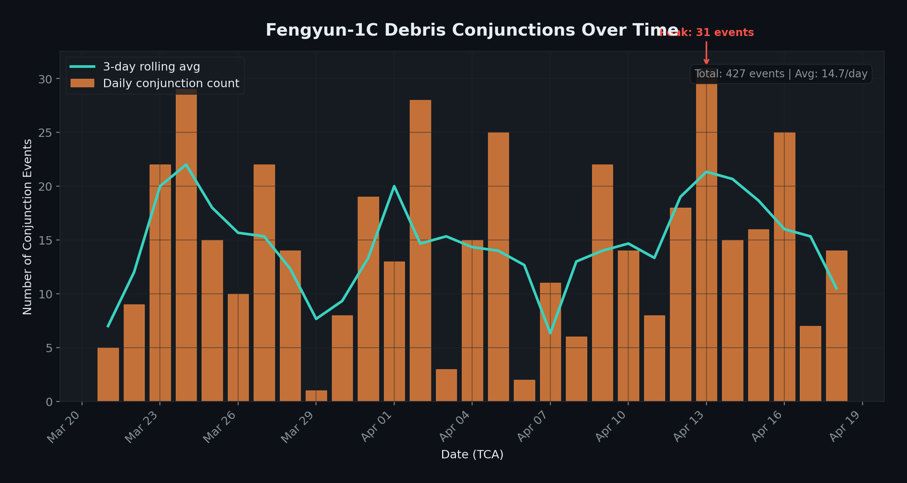
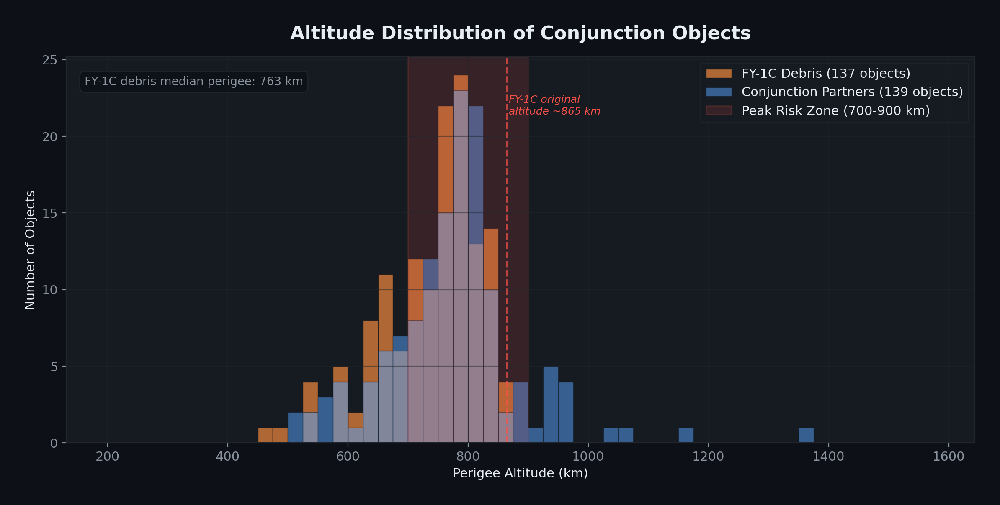
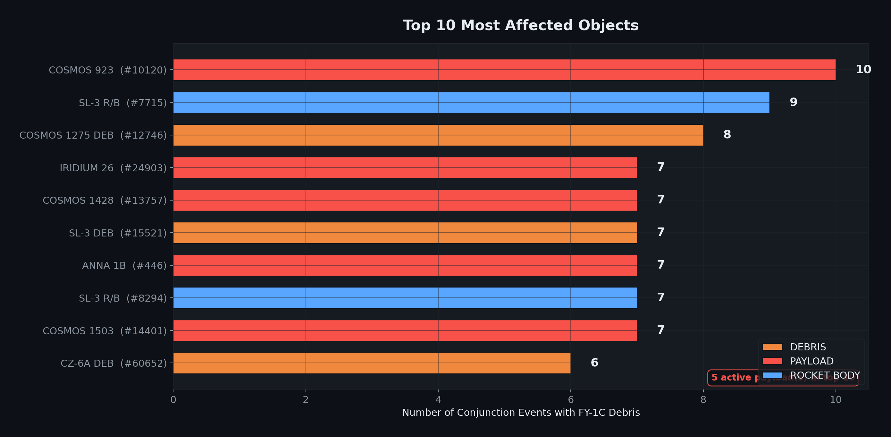
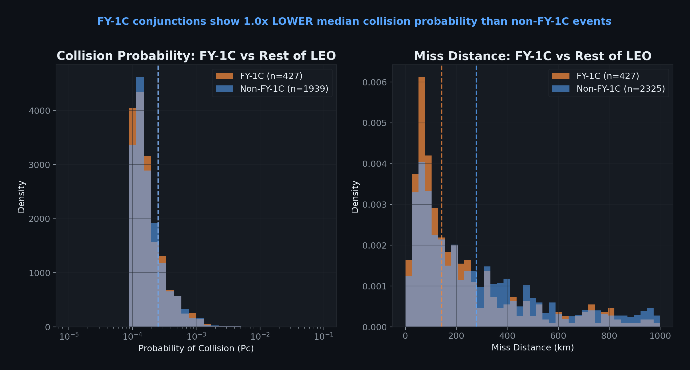
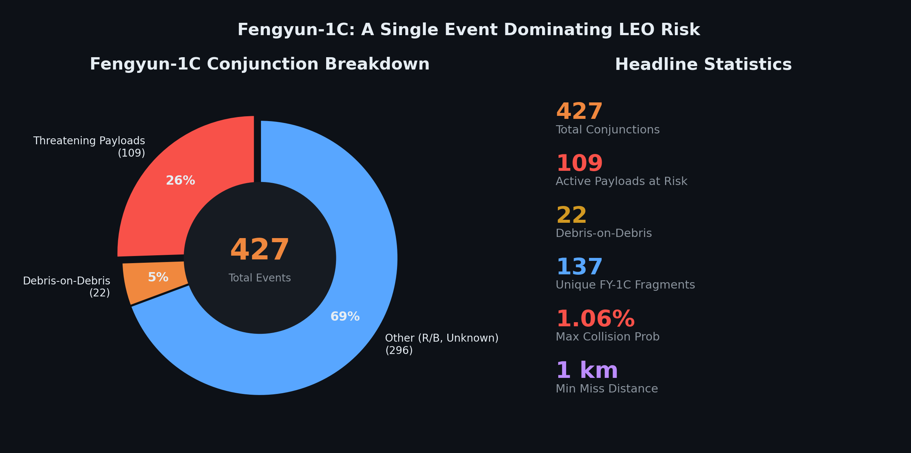
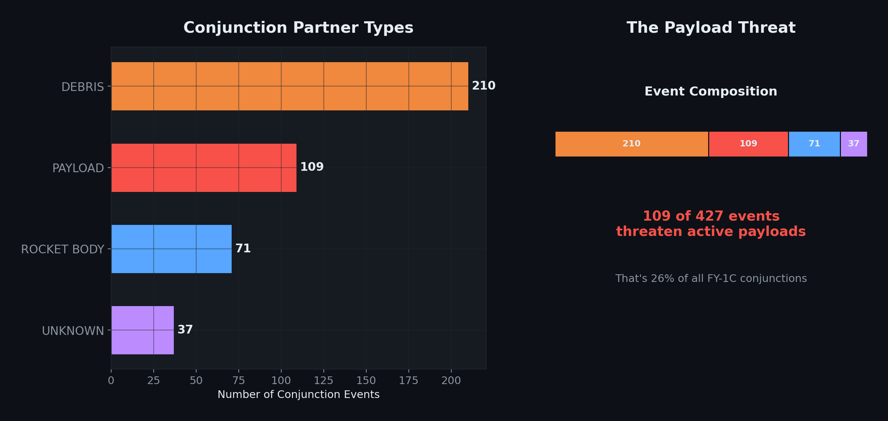
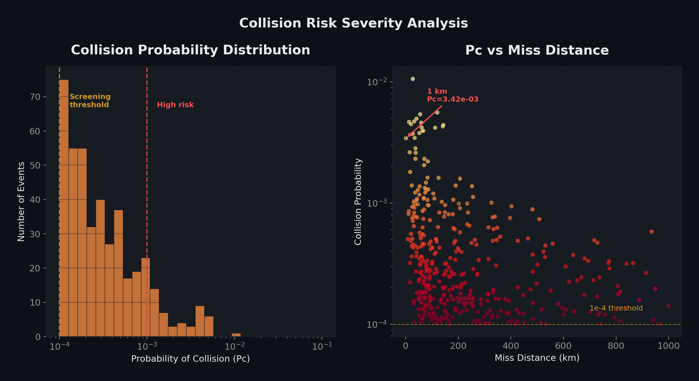

# Fengyun-1C Debris and Its Role in LEO Conjunction Risk (2026)

> **A single weapons test in 2007 is responsible for 1 in 6 conjunction warnings in low Earth orbit today.**

This case study analyzes real conjunction data from the U.S. Space Command (via [Space-Track.org](https://www.space-track.org)) to quantify the ongoing impact of the Fengyun-1C anti-satellite test on orbital safety — 19 years after the event.

---

## The Bottom Line

A typical satellite operating at 600–900 km altitude faces **~3 Fengyun-1C conjunction alerts per month**. The worst-affected satellite receives nearly **11 alerts per month** — one every three days — from this single debris source alone.

---

## Background

On **January 11, 2007**, China destroyed its own Fengyun-1C weather satellite at ~865 km altitude using a kinetic kill vehicle. The test created the **largest tracked debris cloud in history**: over **3,500 cataloged fragments** that remain in orbit today.

This study uses **Conjunction Data Messages (CDMs)** — the official collision warning products issued by the 18th Space Defense Squadron — to measure FY-1C's contribution to LEO conjunction risk in 2026.

---

## Key Findings

### Finding 1 — Prevalence: 15.6% of all LEO conjunctions

Fengyun-1C debris accounts for **427 of 2,738** conjunction events during the study period (March 21 – April 18, 2026). Among all debris-involved conjunctions, FY-1C's share rises to **18.8%**.

Only **137 of 3,531** cataloged FY-1C fragments (3.9%) were involved — meaning a small fraction of the cloud drives all the risk.



---

### Finding 2 — Altitude: Risk peaks at 700–800 km

**229 of 427 events** (54%) occur in the 700–800 km altitude band — directly around the original destruction altitude of ~865 km. FY-1C debris orbits cluster tightly at **98.8° inclination** (sun-synchronous), which is also one of the most commercially valuable orbit regimes.



---

### Finding 3 — Who's at risk: 32 active payloads threatened

**109 conjunction events** involve active payloads. **32 unique operational satellites** from **9 countries** face recurring FY-1C threats:

| Satellite | Country | Events | Max Pc | Closest (km) |
|-----------|---------|--------|--------|---------------|
| COSMOS 923 | Russia | 10 | 5.39×10⁻³ | 27 |
| IRIDIUM 26 | USA | 7 | 1.27×10⁻³ | 78 |
| COSMOS 1503 | Russia | 7 | 5.58×10⁻³ | 46 |
| COSMOS 1428 | Russia | 7 | 4.71×10⁻³ | 20 |
| ANNA 1B | USA | 7 | 1.07×10⁻³ | 83 |
| OSCAR 17 (DOVE) | Brazil | 6 | 4.88×10⁻⁴ | 189 |
| SPOT 1 | France | 5 | 7.37×10⁻⁴ | 23 |
| IRIDIUM 920 | USA | 5 | 4.82×10⁻⁴ | 95 |
| TOMS EP | USA | 5 | 9.40×10⁻⁴ | 25 |

The most dangerous single event: **GGSE 5** with a collision probability of **1.06%** and miss distance of 27 km.



**Countries most affected by total event count:**

| Country | Satellites | Events |
|---------|-----------|--------|
| Russia (CIS) | 14 | 53 |
| United States | 11 | 36 |
| Brazil | 1 | 6 |
| France | 1 | 5 |

---

### Finding 4 — Trend: Stable frequency, worsening severity

The conjunction rate is **stable at ~14.7 events per day** (peak: 31). However, the severity trend is **worsening** — the second half of the observation period shows higher average Pc values than the first half.

| Period | Avg Events/Day |
|--------|---------------|
| First half (Mar 21 – Apr 3) | 14.1 |
| Second half (Apr 4 – Apr 18) | 15.3 |

---

### Finding 5 — FY-1C passes closer than average

FY-1C conjunctions have **half the median miss distance** of non-FY-1C events:

| Metric | FY-1C | Non-FY-1C | Ratio |
|--------|-------|-----------|-------|
| Median miss distance | 143 km | 278 km | 0.51× |
| Mean miss distance | 223 km | 764 km | 0.29× |
| Median Pc | 2.52×10⁻⁴ | 2.52×10⁻⁴ | 1.0× |
| Max Pc | 1.06×10⁻² | 1.15×10⁻¹ | 0.09× |

While collision probabilities are comparable, FY-1C events consistently pass **closer** — increasing the operational burden on conjunction assessment teams.



---

### Finding 6 — The operational impact

> **A typical satellite at 600–900 km faces ~3 FY-1C conjunction alerts per month.**

| Metric | Value |
|--------|-------|
| Avg alerts/month per object | 3.3 |
| Median alerts/month | 3.3 |
| 75th percentile | 4.3 |
| Worst-case satellite | 10.9/month |
| SSO payloads specifically | 2.4/month |
| Objects in risk zone | 114 |

This means operators must evaluate, screen, and potentially maneuver for FY-1C debris multiple times per month — **from a single event that happened 19 years ago**.



---

## Additional Visualizations

### Object Type Breakdown


49% of FY-1C conjunctions involve other debris (unmanoeuvrable), 26% threaten active payloads, 17% involve rocket bodies.

### Collision Probability Distribution


All 427 events exceed the 10⁻⁴ screening threshold. 13% exceed 10⁻³ (high risk). The closest approach recorded: **1 km at Pc = 3.42×10⁻³**.

---

## Data & Methodology

**Source:** [Space-Track.org](https://www.space-track.org) CDM Public Archive (Conjunction Data Messages released 72+ hours after TCA)

**Period:** March 21 – April 18, 2026 (28 days)

**Pipeline:**
1. Fetched 3,532 FY-1C objects from the satellite catalog
2. Pulled 769 raw CDMs, deduplicated to 427 unique conjunction events
3. Cross-referenced with GP orbital elements for LEO perigee filtering
4. Compared against 2,738 total CDMs for the same period

**Limitations:**
- CDM public data only includes events archived 72+ hours past TCA
- Real-time O/O CDMs (with full covariance) are not publicly available
- The 28-day window captures seasonal snapshot, not year-round trends
- Miss distance values in CDM public are rounded to integers

---

## Repository Structure

```
├── pipeline/                    # Data pipeline
│   ├── spacetrack_client.py     # Space-Track API client
│   ├── processor.py             # CDM classification & filtering
│   ├── run_pipeline.py          # Pipeline entry point
│   └── visualize.py             # 6-chart visualization suite
│
├── analysis/                    # Core analysis scripts
│   ├── q1_prevalence.py         # How common is FY-1C debris?
│   ├── q2_orbits.py             # Which orbits are most affected?
│   ├── q3_risk.py               # Who is at risk?
│   ├── q4_trends.py             # Trend over time
│   ├── impact_metric.py         # Operational "so what?" metric
│   ├── comparison.py            # FY-1C vs non-FY-1C comparison
│   └── run_all.py               # Run all analyses
│
├── data/
│   ├── raw/                     # Cached API responses (gitignored)
│   └── clean/                   # Processed datasets
│       ├── fengyun_conjunctions.csv
│       ├── fengyun_conjunctions.json
│       └── summary_stats.json
│
├── output/
│   ├── charts/                  # 6 publication-quality charts
│   └── analysis/                # Analysis results (JSON + charts)
│
├── requirements.txt
└── .env.example                 # Space-Track credential template
```

## Quick Start

```bash
# 1. Install dependencies
pip install -r requirements.txt

# 2. Set up credentials
cp .env.example .env
# Edit .env with your Space-Track.org credentials

# 3. Run the data pipeline
python -m pipeline.run_pipeline

# 4. Generate visualizations
python -m pipeline.visualize

# 5. Run core analysis
python -m analysis.run_all

# 6. Compute operational impact metric
python analysis/impact_metric.py

# 7. Run FY-1C vs non-FY-1C comparison
python analysis/comparison.py
```

---

## Citation

If you use this analysis, please cite:

```
Fengyun-1C Debris and Its Role in LEO Conjunction Risk (2026).
Data source: 18th Space Defense Squadron via Space-Track.org.
Analysis period: March–April 2026.
```

---

*Built with data from Space-Track.org. This analysis uses publicly archived CDMs and does not include classified or restricted conjunction data.*
